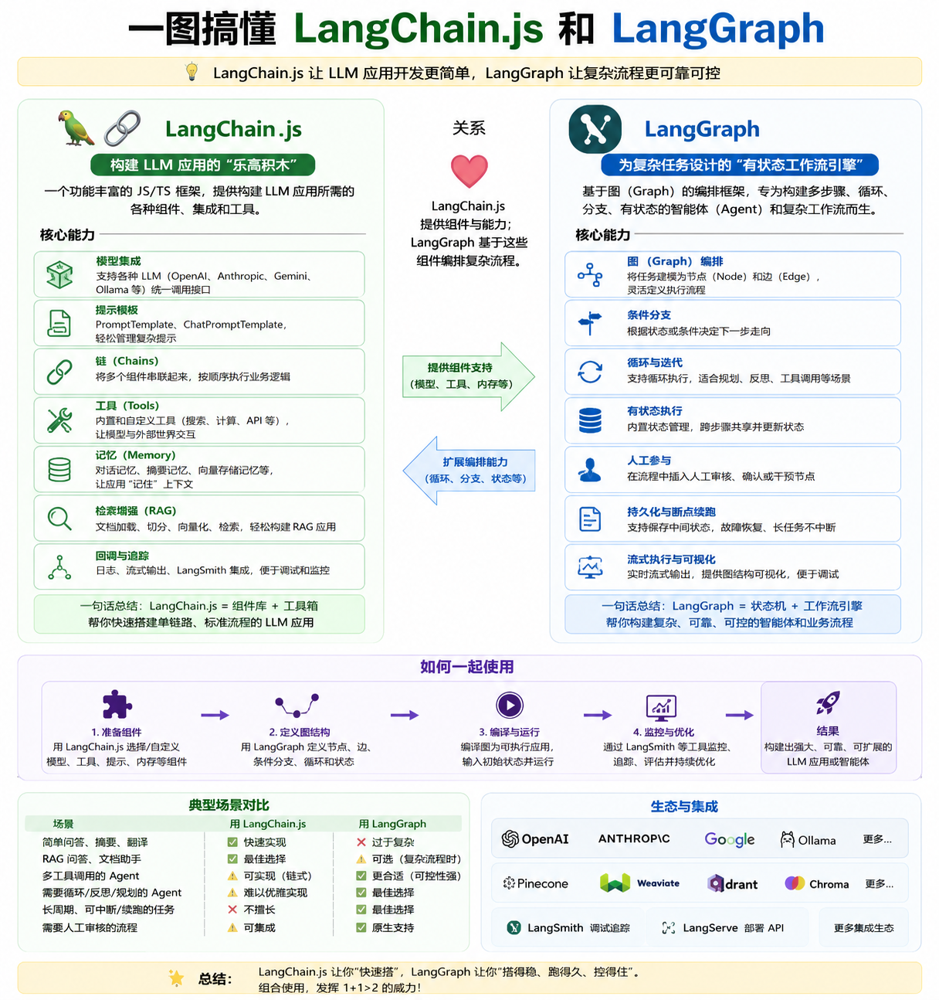

# learn-langchain.js

> LangChain.js LangGraph 工作流教学演示：从 StateGraph 基础到多 Agent 协作


## 课程目标

通过 4 个递进的案例，掌握 **LangGraph 工作流** 的核心能力。学完本课程，你将理解：

- 为什么需要 LangGraph，它解决了 LCEL 链的哪些局限
- StateGraph、Node、Edge、State 的图式编排思想
- 如何实现 Agent 循环、条件分支、状态持久化、人工干预
- 如何从单图脚本逐步演进到一个完整的多 Agent 协作系统

## 学习路线图

```
案例一 ──→ 案例二 ──→ 案例三 ──→ 案例四
StateGraph  Agent循环   Checkpoint  多Agent协作

节点定义    条件边      状态快照    Supervisor
状态流转    ReAct模式   断点续跑    Self-RAG
线性图      工具循环    人工干预    Agent路由
                       Time Travel  消息传递

── 理解度递增，工程复杂度递增 ──>
```

## 环境准备

```bash
# 安装依赖
npm install

# 配置 API Key（在项目根目录创建 .env 文件）
echo "QWEN_API_KEY=your-api-key-here" > .env
```

## 运行案例

```bash
npm start              # 案例一：StateGraph 基础
npm run agent-loop     # 案例二：条件路由与 Agent 循环
npm run checkpoint     # 案例三：Checkpoint 持久化与 Human-in-the-loop
npm run dev            # 案例四：多 Agent 协作 / Self-RAG
```

---

## 案例一：StateGraph 基础

> 源文件：[state-graph.ts](state-graph.ts) · 运行：`npm start`

### 学习目标

掌握 LangGraph 的基础能力 — **构建第一个状态图**，理解节点（Node）、边（Edge）、状态（State）三大要素如何协同工作。

### 核心流程

```
定义 State Schema（状态结构）
        │
        ▼
StateGraph 创建图实例
        │
        ▼
addNode 添加节点（执行任务、更新状态）
        │
        ▼
addEdge 添加边（START → Node A → Node B → END）
        │
        ▼
compile 编译为可执行图
        │
        ▼
graph.invoke(initialState) 触发执行
```

### 关键实现要点

| 要点 | 说明 |
|---|---|
| State Schema | 使用 `Annotation` 定义状态字段及其 reducer（合并策略） |
| Node | 普通函数，输入 state，返回部分 state 更新 |
| Edge | `addEdge(from, to)` 定义节点间的有向连接 |
| START / END | 内置常量，标识图的入口和出口 |
| compile | 将图结构编译为可执行的 Runnable |
| invoke / stream | 复用 LCEL 的调用接口，支持流式输出 |

### 观察重点

- 状态在节点间是如何传递和合并的？
- reducer（如 `Annotation.Root` 中的 `messages`）解决了什么问题？
- 与 LCEL `RunnableSequence` 的写法对比，多了哪些表达力？

---

## 案例二：条件路由与 Agent 循环

> 源文件：[agent-loop.ts](agent-loop.ts) · 运行：`npm run agent-loop`

### 学习目标

在案例一的基础上，**引入条件边（Conditional Edge）实现循环** — 构建一个 ReAct 风格的 Tool Calling Agent，模型自主决定是否继续调用工具。

### 与案例一的对比

| 对比 | 案例一 | 案例二 |
|---|---|---|
| 边类型 | 普通边（addEdge） | 条件边（addConditionalEdges） |
| 流程 | 线性，节点固定顺序 | 循环，根据状态动态路由 |
| 终止 | 到达 END | 模型不再调用工具时跳转 END |

### 核心流程

```
用户提问
   │
   ▼
agent 节点 ──→ LLM 判断是否需要调用工具
   │
   ▼
条件路由：tool_calls 是否为空？
   │
   ├── 非空 ──→ tools 节点 ──→ 执行工具 ──→ 返回 agent
   │
   └── 为空 ──→ END（输出最终回答）
```

### 关键实现要点

```ts
// 条件函数：根据状态决定下一节点
function shouldContinue(state: typeof StateAnnotation.State) {
  const lastMessage = state.messages[state.messages.length - 1];
  if (lastMessage.tool_calls?.length) {
    return "tools";
  }
  return END;
}

// 构图：agent ↔ tools 形成循环
const workflow = new StateGraph(StateAnnotation)
  .addNode("agent", callModel)
  .addNode("tools", toolNode)
  .addEdge(START, "agent")
  .addConditionalEdges("agent", shouldContinue)  // 条件路由
  .addEdge("tools", "agent");                    // 工具执行后回到 agent

const app = workflow.compile();
```

### 观察重点

- 同一个问题可能触发几轮工具调用？循环什么时候结束？
- 与 5.0 分支用 LCEL 实现的 Agent 相比，LangGraph 的循环写法清晰在哪里？
- 如果工具执行失败，如何在条件函数中加入容错路由？

---

## 案例三：Checkpoint 持久化与 Human-in-the-loop

> 源文件：[checkpoint.ts](checkpoint.ts) · 运行：`npm run checkpoint`

### 学习目标

为 Agent 加入 **状态持久化** 与 **人工干预** 能力 — 中途暂停、保存进度、人工审批后再继续，这是 LangGraph 区别于 LCEL 的核心优势。

### 与案例二的对比

| 对比 | 案例二 | 案例三 |
|---|---|---|
| 状态保存 | 仅内存 | Checkpointer 持久化 |
| 中断恢复 | 不支持 | 支持断点续跑 |
| 人工干预 | 不支持 | `interrupt` 暂停等待审批 |
| 时间旅行 | 不支持 | 可回溯到历史 checkpoint |

### 核心流程

```
graph.compile({ checkpointer })  ──→ 启用持久化
        │
        ▼
graph.invoke(input, { configurable: { thread_id } })
        │
        ▼
执行到 interrupt 节点 ──→ 暂停 ──→ 保存 checkpoint
        │
        ▼
人工审查 / 修改状态
        │
        ▼
graph.invoke(null, { configurable: { thread_id } })  ──→ 从断点恢复
```

### 关键实现要点

```ts
import { MemorySaver } from "@langchain/langgraph";

// 1. 创建 checkpointer（生产环境可用 SqliteSaver / PostgresSaver）
const checkpointer = new MemorySaver();

// 2. 编译时传入 checkpointer
const app = workflow.compile({
  checkpointer,
  interruptBefore: ["tools"],  // 在执行工具前暂停
});

// 3. 使用 thread_id 标识会话
const config = { configurable: { thread_id: "user-001" } };

// 4. 首次调用：执行到中断点暂停
await app.invoke({ messages: [userMessage] }, config);

// 5. 查看当前状态，人工决策
const state = await app.getState(config);
console.log("待审批的工具调用：", state.values.messages);

// 6. 恢复执行（传入 null 表示从断点继续）
await app.invoke(null, config);

// 7. 时间旅行：回溯到历史 checkpoint
const history = app.getStateHistory(config);
```

### 观察重点

- 同一个 `thread_id` 多次调用，状态是如何累积的？
- `interruptBefore` 和 `interruptAfter` 的区别是什么？
- 如果在中断时修改了 state，恢复后的执行轨迹会改变吗？

---

## 案例四：多 Agent 协作 / Self-RAG

> 源文件：[self-rag.ts](self-rag.ts) · 运行：`npm run dev`

### 学习目标

综合运用前三个案例的能力，构建 **Self-RAG 自我修正工作流** — 检索文档 → 评估相关性 → 生成答案 → 评估质量 → 不满意则重写问题重新检索，直至产出高质量回答。

### 功能特性

| 特性 | 说明 |
|---|---|
| 文档检索 | 复用 7.0 的 FaissStore 向量索引 |
| 相关性评分 | LLM 评估检索结果是否回答了问题 |
| 答案生成 | 仅基于通过评分的文档生成回答 |
| 答案评估 | 检查答案是否产生幻觉、是否回答了问题 |
| 问题重写 | 不通过则重写问题，重新检索 |
| 多 Agent 路由 | Supervisor 模式协调多个专业 Agent |

### 架构概览

```
用户问题
   │
   ▼
retrieve 节点 ──→ 从向量库检索文档
   │
   ▼
grade_documents 节点 ──→ LLM 评估相关性
   │
   ┌──── 条件路由 ────┐
   ▼                 ▼
 generate         transform_query
（生成答案）       （重写问题）
   │                 │
   ▼                 └──→ 回到 retrieve
grade_generation
（评估答案质量）
   │
   ┌──── 条件路由 ────┐
   ▼                 ▼
  END           transform_query
（输出回答）      （继续优化）
```

### 关键实现要点

```ts
// 节点：检索 → 评分 → 生成 → 再评分
const workflow = new StateGraph(StateAnnotation)
  .addNode("retrieve", retrieve)
  .addNode("grade_documents", gradeDocuments)
  .addNode("generate", generate)
  .addNode("transform_query", transformQuery)
  .addNode("grade_generation", gradeGeneration)
  .addEdge(START, "retrieve")
  .addEdge("retrieve", "grade_documents")
  .addConditionalEdges("grade_documents", decideToGenerate, {
    generate: "generate",
    transform_query: "transform_query",
  })
  .addEdge("transform_query", "retrieve")
  .addEdge("generate", "grade_generation")
  .addConditionalEdges("grade_generation", gradeGenerationDecision, {
    useful: END,
    not_useful: "transform_query",
    not_supported: "generate",
  });

// 流式执行，观察每个节点的中间状态
for await (const output of await app.stream(input)) {
  for (const [nodeName, nodeOutput] of Object.entries(output)) {
    console.log(`节点 ${nodeName} 输出：`, nodeOutput);
  }
}
```

### 观察重点

- 当检索结果不相关时，问题是如何被重写的？
- 答案评估有「not_supported（幻觉）」和「not_useful（答非所问）」两种失败模式，分别如何处理？
- 与 7.0 的 RAG Chain 对比，Self-RAG 在哪些场景下显著更可靠？

---

## 核心概念速查

### LangGraph 核心要素

| 概念 | 说明 |
|---|---|
| **StateGraph** | 以状态图方式编排工作流，支持循环、分支、并行 |
| **Node** | 图中的节点，执行具体任务并返回状态更新 |
| **Edge** | 节点间的连接，分为普通边和条件边（Conditional Edge） |
| **State** | 贯穿整个图的共享状态，由 Annotation 定义结构与 reducer |
| **Checkpointer** | 状态快照机制，支持持久化、恢复与时间旅行 |
| **interrupt** | 在关键节点暂停执行，等待人工审批后继续 |
| **Multi-Agent** | 多个 Agent 协作，常见模式有 Supervisor、Swarm |

### 边的类型

| 类型 | 说明 |
|---|---|
| **普通边** | `addEdge(from, to)`，固定的下一节点 |
| **条件边** | `addConditionalEdges(from, fn)`，根据状态动态路由 |
| **入口边** | `addEdge(START, node)`，定义图的起点 |
| **出口边** | `addEdge(node, END)`，定义图的终点 |

### LCEL vs LangGraph

| 对比项 | LCEL（Chain） | LangGraph |
|---|---|---|
| 结构 | 单向流水线 | 有向图（支持循环） |
| 状态 | 数据沿管道流动 | 全局共享状态 |
| 适用场景 | 线性任务、简单编排 | Agent 循环、复杂工作流 |
| 持久化 | 无内置支持 | 内置 Checkpoint |
| 人工干预 | 难以实现 | 原生支持 |

### 选型建议

| 场景 | 推荐方案 |
|---|---|
| 学习图式编排基础 | 案例一 `state-graph.ts` |
| 构建 Tool Calling Agent | 案例二 `agent-loop.ts` |
| 需要持久化或人工审批 | 案例三 `checkpoint.ts` |
| 生产级复杂工作流 | 案例四 `self-rag.ts` |

---

## 项目结构

```
├── state-graph.ts      # 案例一：StateGraph 基础
├── agent-loop.ts       # 案例二：条件路由与 Agent 循环
├── checkpoint.ts       # 案例三：Checkpoint 持久化与 Human-in-the-loop
├── self-rag.ts         # 案例四：多 Agent 协作 / Self-RAG
├── public/
│   └── index.html      # 前端页面（案例四使用）
├── library/
│   └── reference.pdf   # 知识库文档（案例四使用）
└── faiss_index/        # 向量索引缓存（案例四复用 7.0 的索引）
```
